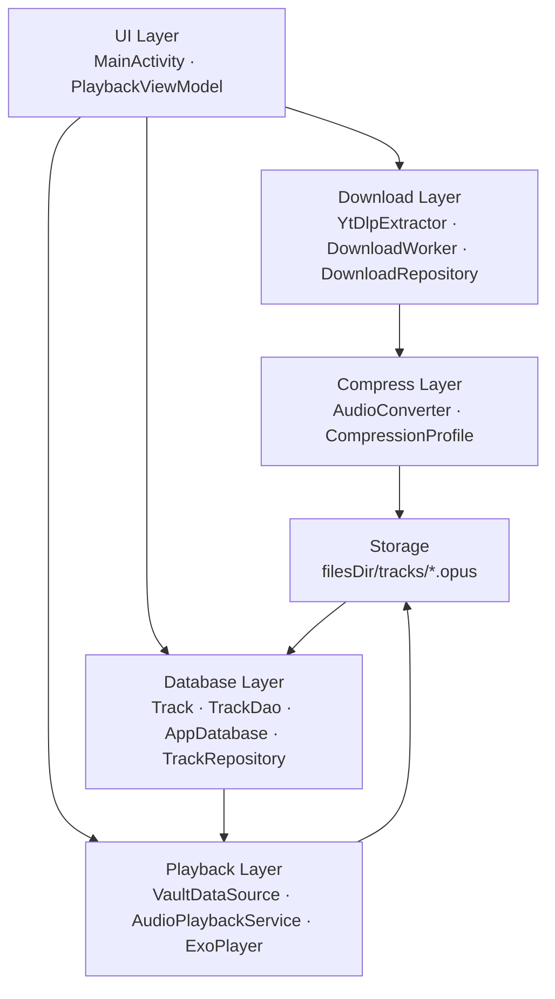

# Architecture

This document describes Milya's layer architecture, data flow, and key design decisions.

---

## Table of Contents

- [Overview](#overview)
- [Layer Diagram](#layer-diagram)
- [Layers](#layers)
- [Data Flow](#data-flow)
- [Key Design Decisions](#key-design-decisions)
- [Threading Model](#threading-model)

---

## Overview

Milya is a single-module Android app structured in six vertical layers. Each layer has one responsibility and communicates downward only — UI never touches the file system directly, and the playback layer never knows about YouTube.

---

## Layer Diagram



---

## Layers

### UI (`ui/`)
`MainActivity` and `PlaybackViewModel`. Owns no business logic — delegates to repositories and the `MediaController`. Observes Room via `Flow`.

### Download (`download/`)
`YtDlpExtractor` resolves a YouTube URL to a direct audio stream URL. `DownloadWorker` (WorkManager) fetches the stream in the background, retries on failure, and chains into compression on success. `DownloadRepository` is the single entry point for the UI to enqueue or cancel downloads.

### Compress (`compress/`)
`AudioConverter` invokes ffmpeg-kit to transcode the downloaded file to Opus. The `CompressionProfile` enum encodes all ffmpeg argument decisions (bitrate, mono, VBR mode, lowpass filter, frame duration, application mode). Raw input files are deleted after a successful encode.

### Database (`db/`)
Room database with a single `Track` entity. `TrackRepository` is the source of truth for track metadata, playback state, and eviction queries. The UI and playback layer both read from here — never from the file system directly.

### Playback (`playback/`)
`AudioPlaybackService` extends `MediaSessionService` and owns the ExoPlayer instance. Runs as a foreground service with a wake lock so audio continues when the screen is off. `VaultDataSource` is a custom Media3 `DataSource` that reads `.opus` bytes from `filesDir` and updates `lastPlayedAt` in Room on open.

### Storage (`filesDir/tracks/`)
Raw `.opus` files on disk. Named by `trackId`. Never accessed directly by UI or download layers — always via `TrackRepository` or `VaultDataSource`.

---

## Data Flow

### Download → Playback

```
User pastes YouTube URL
  → DownloadRepository.enqueue(url)
    → DownloadWorker downloads stream to temp file
      → AudioConverter.transcode(tempFile) → filesDir/tracks/<id>.opus
        → temp file deleted
          → TrackRepository.insert(Track(...))
            → UI observes Room Flow → track appears in list
              → User taps track
                → MediaController.setMediaItem(vault://tracks/<id>)
                  → VaultDataSource.open() reads .opus bytes
                    → ExoPlayer decodes Opus ring buffer
                      → AudioPlaybackService plays audio
```

### Eviction

```
EvictionWorker runs every 24h
  → TrackRepository.getUnplayedBefore(now - 14 days)
    → for each stale track:
        File(track.filePath).delete()
        TrackRepository.delete(track)
```

---

## Key Design Decisions

### Why Opus over MP3/AAC?
Opus has a newer psychoacoustic model and outperforms MP3 and AAC at equivalent low bitrates. At 16 kbps mono it remains intelligible for speech; MP3 at 16 kbps is unusable. See [Compression Profiles](README.md#compression-profiles).

### Why WorkManager over a custom Service for downloads?
WorkManager survives process death, handles retry/backoff, respects battery and network constraints, and integrates with the system job scheduler across API levels. A custom `Service` would replicate all of this manually.

### Why MediaSessionService over a plain Service?
`MediaSessionService` (Media3) automatically manages the foreground notification with media controls, integrates with the system media session (lock screen, Bluetooth controls, Google Assistant), and handles audio focus. A plain `Service` would require ~200 lines of boilerplate to replicate this.

### Why `filesDir` over external storage?
`filesDir` is private to the app, requires no storage permissions, and is automatically cleared on uninstall. Since this is a private personal app with no sharing requirement, external storage adds complexity with no benefit.

---

## Threading Model

| Layer | Thread |
|---|---|
| UI | Main thread |
| DownloadWorker | WorkManager thread pool (IO) |
| AudioConverter (ffmpeg-kit) | ffmpeg-kit's internal thread |
| Room queries | Coroutine `Dispatchers.IO` |
| VaultDataSource reads | ExoPlayer's loading thread |
| ExoPlayer decode | ExoPlayer's internal playback thread |

No manual thread management — WorkManager, Coroutines, and ExoPlayer own their threads.
